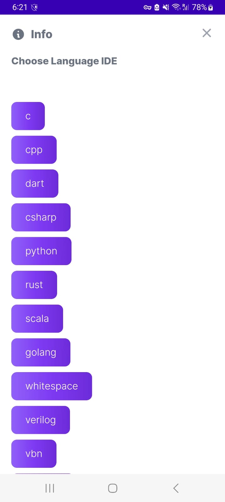

# Online Compiler and IDE

> This is a WebApp which can compile/Interpret 75+ Programming Languages.

- App Snaps




- Desktop Snaps


>The focus was on Backend logic so UI isn't appreciable (as of now)
- Also I've no life and I'm bored so there are languages which nobody uses,but go on to explore new stuff ;)

> To run the app on Local machine:
# Install Dependencies:
 ```
    cd <filename> 
    npm i 
  ```

# Run App:
- Via the command `node app.js`

## Get Started>Choose IDE>Code>See Output

# Tech Stack:
Node.js,Express.js,EJS,REST API's From RapidAPI,TailwindCSS,Flowbite

# Future Work?
- Creating a good UI , Optimize Speed , Using Shell scripts to run code on VM and se result without APIs
